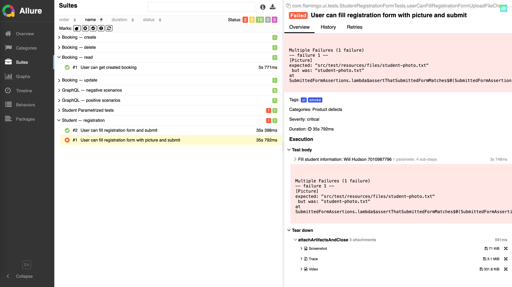

# Viewing failed test attachments

When a UI test fails, `BaseTest.@AfterEach` attaches three things to the
Allure report: a **screenshot** of the browser at the moment of failure, a
**Playwright trace** (`.zip`) and a **video** (`.webm`) of the whole test.
For a failed test with an uploader enabled you also get a direct link to
open the trace in `trace.playwright.dev`.

This doc walks through opening each of them, whether you're looking at the
report locally or on CI.

## Where the report lives

### Locally

After a test run:

```bash
./gradlew :ui-tests:allureServe     # opens a local server in your browser
./gradlew :ui-tests:allureReport    # writes static HTML into build/reports/allure-report/
./gradlew allureServe               # aggregated across modules
```

### On CI

Every push to `main` (and every manual dispatch) publishes the report to
GitHub Pages:

```
https://<user>.github.io/<repo>/
```

If you want the raw artifacts instead of the report (e.g. to open a trace
locally), each workflow run also uploads them:

- `allure-results-api-rest`, `allure-results-api-graphql`, `allure-results-ui`
  — raw JSON per job.
- `allure-report` — the combined static HTML.
- `playwright-artifacts` — raw traces and videos from the UI job.

Go to **Actions → your run → Summary** and download whichever you need.

## Finding a failed test

1. Open **Suites** on the left sidebar (or **Behaviours** if you prefer the
   `@Epic → @Feature → @Story` tree).
2. Above the tree there's a **Marks** row with coloured icons. Click the
   red ❌ to filter down to failures only.
3. Expand the suite that contains the failing test. Failed tests appear
   with a red status pill on the right.
4. Click the test name — the details pane opens on the right.

## The attachments panel

For a failed test the details pane has an **Execution** section with
`Test body` and `Tear down` subsections. The Playwright artifacts live
inside `Tear down → attachArtifactsAndClose`:

```
Test body
  > Fill student information: Will Hudson  (steps…)
  Assertion failure

Tear down
  attachArtifactsAndClose (3 attachments)
    > Screenshot   71 KiB
    > Trace        3.1 MiB
    > Video        331 KiB
```



Each entry has two useful controls on the right:

- 📎 (the file icon) — download the file to your machine.
- ⤢ (expand icon) — open the attachment inline where Allure can render it.

## Opening each attachment type

### Screenshot

Just click it. Allure renders PNGs directly in the panel. If you need the
raw file to attach to a bug report — download with the file icon.

### Trace

This is the most useful of the three when debugging a UI failure. It's a
zip containing the full Playwright snapshot — every action, network call,
DOM snapshot, and console log.

**Two ways to open it:**

**Option 1 — the direct link (if the run was on CI).**
For failed tests the report also has a `Links` section with
**"Open trace in Playwright viewer"**. Click it — the trace opens in
`trace.playwright.dev` with the file already loaded. Zero setup.

This works because `TraceUploader` posts the trace to `0x0.st` and puts
the resulting URL in the link. Only used for failed tests, and only
when the network call succeeds — if it doesn't, use option 2.

**Option 2 — drag and drop.**
1. Download the `Trace` attachment (📎 icon in the Allure panel).
2. Open [https://trace.playwright.dev/](https://trace.playwright.dev/) in
   any browser.
3. Drag the `.zip` file into the page.

The viewer opens with a timeline of actions, screenshots at each step,
network requests, DOM snapshots and the full console output. You can
click through actions and watch the DOM change at each point.

## Reading a Playwright trace — the parts you'll actually use

Once the trace opens:

- **Timeline** across the top — a filmstrip of screenshots at every action.
  Click any frame to jump to that moment.
- **Actions list** on the left — each line is one Playwright call
  (`click`, `fill`, `expect`, `waitFor`…). Failed actions are red.
- **Snapshot view** in the middle — a live DOM snapshot at the selected
  moment. You can hover elements, inspect them, even use DevTools.
- **Tabs on the right** — Console, Network, Source. Console shows the
  browser's own logs; Network shows what the page requested; Source shows
  which line of your test triggered the current action.

For a locator failure — jump to the failed action, then look at the
snapshot. Nine times out of ten you'll immediately see that the element
wasn't there yet, was covered by an overlay, or was rendered in a
different form than expected.

## Running from local artifacts, not the report

If you downloaded `playwright-artifacts` from CI directly (not through
Allure):

```
playwright-artifacts/
├── traces/
│   └── <testName>.zip
└── playwright-artifacts/
    └── videos/
        └── page@<hash>.webm
```

Traces open in `trace.playwright.dev` the same way. Videos play in any
browser or media player.

## Quick reference

| I want to… | Do this |
|---|---|
| Filter Allure to failures only | Click the red ❌ under **Marks** |
| See the browser at the failure | `Tear down → Screenshot` |
| Watch the test run | `Tear down → Video` |
| Debug a locator or timing bug | Open `Trace` in `trace.playwright.dev` |
| Grab raw files from CI | Actions → run → Summary → download artifact |
